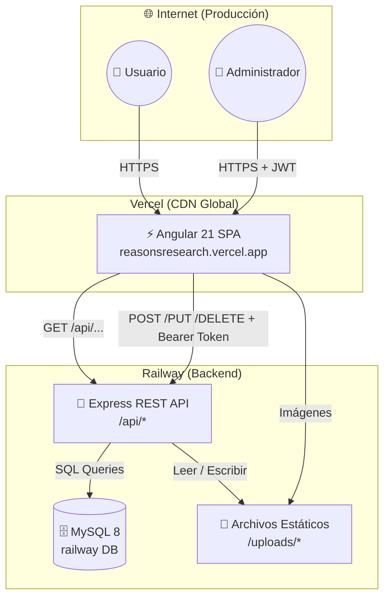
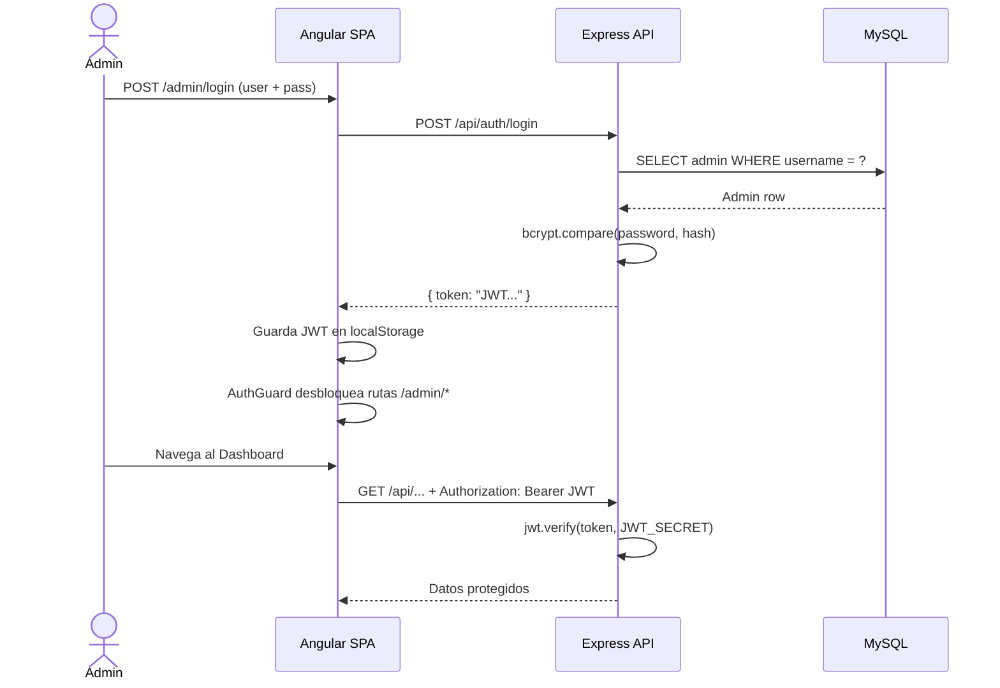

# 🔬 Portal Web Institucional — REASONS UTA

> Plataforma web full-stack, autoadministrable y de arquitectura desacoplada para el grupo de investigación **REASONS** (*Research in Engineering and Advanced Sustainable Operations, Nature, and Society*) de la **Universidad Técnica de Ambato**.

[](https://angular.dev/)
[](https://nodejs.org/)
[](https://expressjs.com/)
[](https://www.mysql.com/)
[](https://tailwindcss.com/)
[](https://swagger.io/)
[](https://vercel.com/)
[](https://railway.app/)
[](https://opensource.org/licenses/MIT)

---

## 📋 Descripción

El **Portal REASONS** es una solución web completa que permite al grupo de investigación gestionar de forma autónoma toda su presencia institucional en línea: investigadores, proyectos, publicaciones científicas, configuración visual corporativa y un buzón de contacto, todo desde un panel de administración protegido por autenticación JWT.

| Aspecto | Detalle |
|---|---|
| 🎯 **Propósito** | Vitrina institucional y panel CMS autoadministrable para grupo de investigación |
| 👥 **Público** | Docentes, investigadores y visitantes de la UTA |
| 🏛️ **Institución** | Universidad Técnica de Ambato — Ecuador |
| 🔗 **Demo en vivo** | [reasonsresearch.vercel.app](https://reasonsresearch.vercel.app) |

---

## ✨ Características Principales

- 🏠 **Página de inicio dinámica** con carrusel de imágenes (Hero Slider) completamente administrable
- 👤 **Gestión de investigadores** con foto de perfil, ORCID y redes sociales
- 🧪 **Catálogo de proyectos de investigación** con imágenes, descripción y equipo asociado
- 📄 **Publicaciones científicas** con DOI, resumen (abstract), citación y portada de revista
- 📬 **Buzón de contacto** con gestión de estados (`sin leer`, `leído`, `respondido`)
- 🎨 **Motor de colores corporativos en tiempo real** — cambio de paleta desde el panel sin recompilar
- 🖼️ **Compresor de imágenes en cliente** (Canvas API) — reduce hasta 95% el peso antes del envío
- 🔐 **Autenticación JWT** con guardianes de ruta y expiración automática de sesión
- 🛡️ **Seguridad multicapa** — Helmet, CORS, Rate Limiting, bcrypt y validación anti-XSS
- 📑 **Documentación interactiva** de la API con Swagger UI (`/api-docs`)
- 📱 **Diseño 100% responsivo** con menús colapsables para móvil y tablet

---

## 🛠️ Stack Tecnológico

### Frontend
| Tecnología | Versión | Rol |
|---|---|---|
| Angular | 21.x | Framework SPA principal |
| TypeScript | 5.9.x | Lenguaje de programación |
| Tailwind CSS | 4.x | Sistema de estilos utilitario |
| Angular Router | 21.x | Enrutamiento con lazy loading |
| RxJS | 7.8.x | Manejo reactivo de streams y HTTP |

### Backend
| Tecnología | Versión | Rol |
|---|---|---|
| Node.js | 20+ | Runtime de JavaScript en servidor |
| Express | 4.19.x | Framework HTTP REST |
| MySQL2 | 3.9.x | Conector de base de datos |
| JSON Web Token | 9.x | Autenticación stateless |
| bcryptjs | 2.4.x | Hash criptográfico de contraseñas |
| Multer | 1.4.x | Gestión de subida de archivos |
| Helmet | 7.x | Cabeceras HTTP de seguridad |
| express-rate-limit | 7.x | Limitación de tasa de peticiones |
| express-validator | 7.x | Sanitización y validación de inputs |
| Swagger (OpenAPI 3.0) | 6.x | Documentación interactiva de la API |

### Base de Datos e Infraestructura
| Tecnología | Uso |
|---|---|
| MySQL 8.0 | Base de datos relacional (InnoDB) |
| Railway | Hosting del backend y MySQL en producción |
| Vercel | Hosting y CDN del frontend Angular |
| Neon | (Alternativa PostgreSQL en evaluación) |

---

## 🏗️ Arquitectura

El proyecto implementa una arquitectura **desacoplada SPA + REST API**:



### Flujo de Autenticación



---

## 📁 Estructura del Repositorio

```
portal-web-reasons-uta/
│
├── .env                        # Variables de entorno (NO subir a Git)
├── .env.example                # Plantilla de variables de entorno
├── package.json                # Scripts raíz del monorepo
├── vercel.json                 # Configuración SPA fallback para Vercel
│
├── backend/                    # 🚀 API REST (Express + Node.js)
│   ├── src/
│   │   ├── app.js              # Punto de entrada del servidor
│   │   ├── config/
│   │   │   ├── db.js           # Pool de conexiones MySQL2
│   │   │   └── swagger.js      # Configuración OpenAPI 3.0
│   │   ├── controllers/        # Lógica de negocio por módulo
│   │   ├── middleware/         # JWT, Rate Limiting, Multer, Validaciones
│   │   └── routes/             # Enrutadores REST por recurso
│   │       ├── authRoutes.js
│   │       ├── settingsRoutes.js
│   │       ├── researchersRoutes.js
│   │       ├── projectsRoutes.js
│   │       ├── publicationsRoutes.js
│   │       └── contactRoutes.js
│   └── uploads/                # Almacenamiento local de archivos multimedia
│
├── frontend/                   # ⚡ SPA Angular 21 + Tailwind CSS 4
│   ├── src/app/
│   │   ├── core/               # Servicios globales, guards, interceptores, utils
│   │   ├── shared/             # Layouts reutilizables (público y admin)
│   │   └── features/           # Módulos de funcionalidad por página
│   │       ├── home/           # Página de inicio con Hero slider
│   │       ├── researchers/    # Directorio de investigadores
│   │       ├── projects/       # Catálogo de proyectos
│   │       ├── publications/   # Publicaciones científicas
│   │       ├── contact/        # Formulario de contacto público
│   │       └── admin/          # Panel de administración (protegido)
│   ├── proxy.conf.json         # Proxy de desarrollo (API forwarding)
│   └── vercel.json             # SPA routing fallback
│
├── utils/                      # 🔧 Scripts de automatización
│   ├── db-init.js              # Crear base de datos y tablas
│   ├── db-seed.js              # Insertar datos semilla institucionales
│   ├── db-clean.js             # Limpiar y re-sembrar datos
│   ├── db-update-home-images.js # Actualizar imágenes de la página de inicio
│   ├── create-admin.js         # Crear usuario administrador interactivo
│   └── start-dev.js            # Arrancar frontend + backend en paralelo
│
└── docs/                       # 📚 Documentación
    └── database_schema.sql      # DDL relacional (InnoDB)
```

---

## ⚙️ Requisitos Previos

| Herramienta | Versión mínima | Uso |
|---|---|---|
| [Node.js](https://nodejs.org/) | v20.x LTS | Runtime del backend y CLI de Angular |
| [npm](https://www.npmjs.com/) | v10.x | Gestor de paquetes |
| [MySQL](https://www.mysql.com/) | 8.0 | Base de datos relacional |
| [Angular CLI](https://angular.dev/tools/cli) | v21.x | Desarrollo del frontend (opcional, instalado localmente) |

---

## 🚀 Instalación y Ejecución Local

### 1. Clonar el repositorio

```bash
git clone https://github.com/kiramman-mp3/portal-web-reasons-uta.git
cd portal-web-reasons-uta
```

### 2. Configurar variables de entorno

```bash
cp .env.example .env
```

Edita el archivo `.env` con tus datos de conexión a MySQL:

```ini
DB_HOST=localhost
DB_PORT=3306
DB_USER=root
DB_PASSWORD=tu_contraseña
DB_NAME=reasons_db

PORT=3000
JWT_SECRET=tu_clave_secreta_super_segura

NODE_ENV=development
```

### 3. Instalar todas las dependencias

Un solo comando instala las dependencias de la raíz, el backend y el frontend:

```bash
npm run install:all
```

### 4. Inicializar la base de datos

```bash
# Crear la base de datos y todas las tablas relacionales
npm run db:init

# Insertar datos semilla institucionales e imágenes predeterminadas
npm run db:seed
```

### 5. Crear el usuario administrador

```bash
npm run db:admin
```

Sigue las instrucciones en consola para definir usuario y contraseña.

### 6. Iniciar los servidores de desarrollo

```bash
npm run start:dev
```

Esto levanta de forma concurrente:
- 🚀 **Backend** → `http://localhost:3000`
- ⚡ **Frontend** → `http://localhost:4200`
- 📑 **Swagger UI** → `http://localhost:3000/api-docs`

---

## 🌍 Variables de Entorno

Todas las variables se definen en el archivo `.env` en la raíz del proyecto. Consulta [`.env.example`](.env.example) como referencia.

| Variable | Descripción | Ejemplo |
|---|---|---|
| `DB_HOST` | Host del servidor MySQL | `localhost` |
| `DB_PORT` | Puerto de MySQL | `3306` |
| `DB_USER` | Usuario de MySQL | `root` |
| `DB_PASSWORD` | Contraseña de MySQL | `tu_contraseña` |
| `DB_NAME` | Nombre de la base de datos | `reasons_db` |
| `PORT` | Puerto del servidor Express | `3000` |
| `JWT_SECRET` | Clave secreta para firmar los tokens JWT | `clave_larga_y_aleatoria` |
| `NODE_ENV` | Entorno de ejecución | `development` / `production` |

> [!CAUTION]
> **Nunca subas el archivo `.env` al repositorio.** Está incluido en el `.gitignore`. La variable `JWT_SECRET` es obligatoria; el servidor se negará a iniciar si no está configurada.

---

## 📡 API REST — Resumen de Endpoints

La API expone documentación interactiva completa en `/api-docs` (Swagger UI). Los endpoints `GET` son públicos; los de escritura requieren `Authorization: Bearer <token>`.

| Módulo | Método | Ruta | Acceso |
|---|---|---|---|
| Auth | `POST` | `/api/auth/login` | Público |
| Configuración | `GET` | `/api/settings` | Público |
| Configuración | `PUT` | `/api/settings` | 🔐 JWT |
| Configuración | `POST` | `/api/settings/logo` | 🔐 JWT |
| Slides (Hero) | `POST/PUT/DELETE` | `/api/settings/slides/:id` | 🔐 JWT |
| Investigadores | `GET` | `/api/researchers` | Público |
| Investigadores | `POST/PUT/DELETE` | `/api/researchers/:id` | 🔐 JWT |
| Proyectos | `GET` | `/api/projects` | Público |
| Proyectos | `POST/PUT/DELETE` | `/api/projects/:id` | 🔐 JWT |
| Publicaciones | `GET` | `/api/publications` | Público |
| Publicaciones | `POST/PUT/DELETE` | `/api/publications/:id` | 🔐 JWT |
| Contacto | `POST` | `/api/contact` | Público (Rate Limited) |
| Contacto | `GET/PUT/DELETE` | `/api/contact/:id` | 🔐 JWT |

---

## 📜 Scripts Disponibles

### Raíz del monorepo (`package.json`)

| Script | Comando | Descripción |
|---|---|---|
| `install:all` | `npm run install:all` | Instala dependencias en raíz, backend y frontend |
| `start:dev` | `npm run start:dev` | Arranca backend y frontend en paralelo |
| `db:init` | `npm run db:init` | Crea la base de datos y las tablas SQL |
| `db:seed` | `npm run db:seed` | Inserta datos semilla institucionales |
| `db:clean` | `npm run db:clean` | Limpia todas las tablas y re-siembra |
| `db:admin` | `npm run db:admin` | Crea un usuario administrador de forma interactiva |

### Backend (`backend/`)

| Script | Descripción |
|---|---|
| `npm start` | Inicia el servidor Express en producción |
| `npm run dev` | Inicia el servidor con hot-reload (nodemon) |

### Frontend (`frontend/`)

| Script | Descripción |
|---|---|
| `npm start` | Inicia el servidor de desarrollo de Angular (`ng serve`) |
| `npm run build` | Genera el bundle de producción en `dist/` |
| `npm test` | Ejecuta las pruebas unitarias (Karma) |
| `npm run watch` | Compila en modo watch para desarrollo |

---

## 🔐 Acceso al Panel de Administración

Una vez levantado el servidor localmente:

| Recurso | URL |
|---|---|
| Portal público | `http://localhost:4200` |
| Panel de administración | `http://localhost:4200/admin/login` |
| Documentación Swagger | `http://localhost:3000/api-docs` |

> [!IMPORTANT]
> Las credenciales por defecto se crean con el script `npm run db:admin`. Si usaste `npm run db:seed`, consulta la documentación de semillas para el usuario de demo.

---

## 🗺️ Rutas Públicas del Portal

| Ruta | Descripción |
|---|---|
| `/` | Página de inicio con Hero slider |
| `/equipo` | Directorio de investigadores |
| `/proyectos` | Catálogo de proyectos de investigación |
| `/publicaciones` | Publicaciones y artículos científicos |
| `/contacto` | Formulario de contacto |

---

## 🛡️ Seguridad

El sistema implementa una estrategia de defensa en profundidad:

- **JWT con expiración**: Tokens con tiempo de vida limitado; el cliente detecta tokens expirados y redirige al login automáticamente.
- **bcrypt (12 rondas)**: Hash criptográfico de contraseñas con factor de coste alto.
- **Helmet**: Cabeceras HTTP de seguridad (XSS Protection, MIME sniffing, Clickjacking).
- **CORS estricto**: Control de orígenes cruzados permitidos.
- **Rate Limiting**: Protección en endpoints de login y contacto contra fuerza bruta y spam.
- **express-validator**: Sanitización y validación estricta de todos los campos entrantes.
- **Magic bytes validation**: Verificación del tipo real de archivo subido (no solo extensión).

---

## 🗃️ Base de Datos

El esquema relacional está definido completamente en [`docs/database_schema.sql`](docs/database_schema.sql).

**Tablas principales:**
- `admin_users` — Usuarios con acceso al panel de administración
- `site_settings` — Configuración global y colores corporativos del portal
- `hero_slides` — Diapositivas del carrusel de la página de inicio
- `research_lines` — Líneas de investigación del grupo
- `specific_objectives` — Objetivos específicos institucionales
- `researchers` — Perfiles de investigadores
- `projects` — Proyectos de investigación
- `project_researchers` — Relación N:M entre proyectos e investigadores
- `publications` — Artículos y publicaciones científicas
- `publication_authors` — Relación N:M entre publicaciones e investigadores
- `contact_messages` — Buzón de mensajes del formulario de contacto

---

## 🗺️ Roadmap

- [x] Portal público con secciones de inicio, equipo, proyectos, publicaciones y contacto
- [x] Panel de administración con autenticación JWT
- [x] CRUD completo de investigadores, proyectos, publicaciones y mensajes
- [x] Motor de colores corporativos dinámicos en tiempo real
- [x] Compresor de imágenes en el cliente (Canvas API)
- [x] Documentación interactiva Swagger UI
- [x] Despliegue en producción (Vercel + Railway)
- [ ] Soporte para múltiples idiomas (i18n — Español / Inglés)
- [ ] Módulo de noticias y eventos del grupo
- [ ] Notificaciones por email al recibir mensajes de contacto

---

## 👥 Contribuidores

| Nombre | Commits |
|---|---|
| Johan Rodríguez | 27 |

---

## 📄 Licencia

Este proyecto está bajo la Licencia MIT. Consulta el archivo [LICENSE](LICENSE) para obtener más detalles.

---

## 👤 Autor

**Johan Rodríguez**
- 🏛️ Universidad Técnica de Ambato — Ecuador
- 📁 [github.com/kiramman-mp3](https://github.com/kiramman-mp3)
